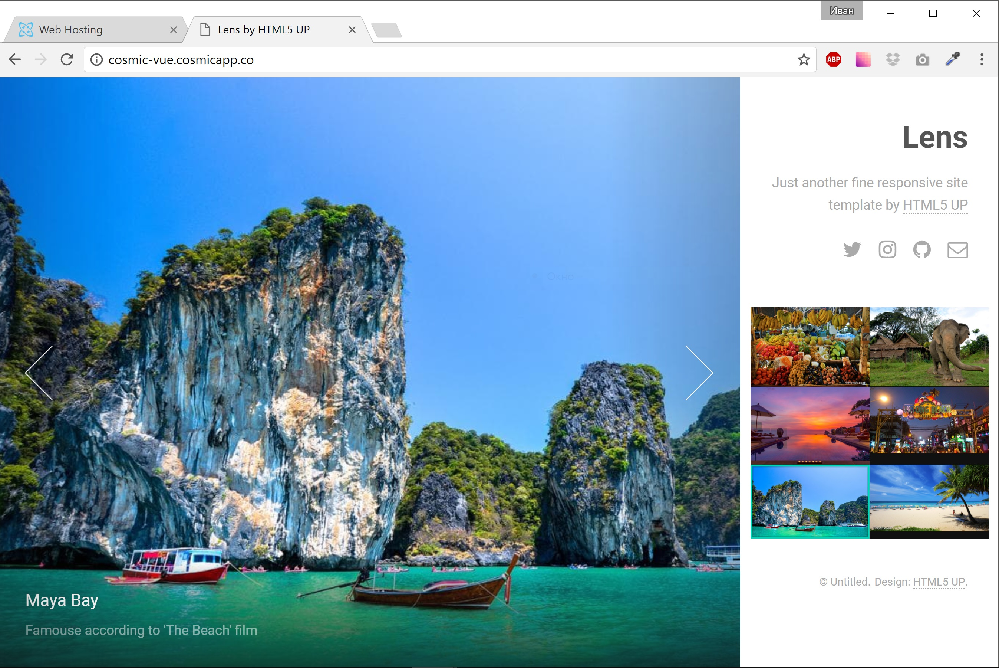
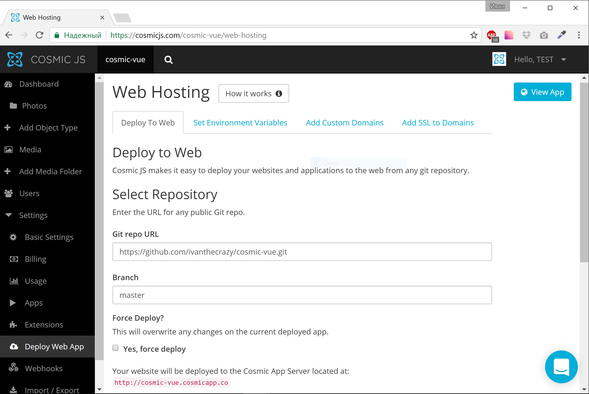

In this tutorial I’m going to show you how to build photo gallery with ready-to-use template, which will be hosted on CosmicJS App Server.

   

# Prerequisites

You’ll need the node JS and npm. Make sure you already have them before start. 

# Getting Started

First of all we’ll need to install VueJS CLI and start the new project.Run the following commands to do this:

```bash
npm install -g vue-cli
vue init webpack vuejs-photo-gallery
cd vuejs-photo-gallery
npm install
```

After you’ll setup this project you’ll be able to run

```bash
cd vuejs-photo-gallery
npm run dev
```

And play with your app in browser

# Doing everything using the existing git repo

First of all, you have to be sure you have node > 6.x installed, than run the following commands:

```bash
npm install -g vue-cli
git clone https://github.com/cosmicjs/vuejs-photo-gallery.git
cd vuejs-photo-gallery
npm install
npm run dev
```

Browser window will open automatically once you'll run the last command

# Setting up Cosmic JS library

First of all, install Cosmic JS Angular/JavaScript library

```bash
npm install cosmicjs --save
```

Now you should be able to import Cosmic object and perform Cosmic JS API calls like following:

```typescript
import Cosmic from 'cosmicjs';
const bucket = { slug: 'your-bucket-slug' };

Cosmic.getObjects({ bucket }, (err, res) => {
  console.log(res.objects);
});
```

# Setting up things with Cosmic JS

Create the bucket and remeber the bucket name (`vuejs-photo-gallery` in our case):

Than create a new object type named Photo.

We also need a way to store the picture itself. Please enter the “Metafields Template” tab and add “Image/File” type metafield with key `image`. This metafield will store the image. We don’t need anything more, so just set the name and save object type.
After save you’ll be redirected to ‘New Photo’ page. Create some photos using this page and save them - we'll use them as test data.


The only thing left is to set site-wide things, such as title, tagline, social icons and footer text. Let's create one more object type named Global.
And add the following metafields:

* Tagline - Plain Text Area
* Twitter - Plain Text Input
* Instagram - Plain Text Input
* Github - Plain Text Input
* Email - Plain Text Input
* Footer - Plain Text Area

# VueJS environments

We want to pick our bucket name automatically on deploy. In this case we'll need configuration file, which we'll populate with correct data during deploy.
Create `src/config.js` to match the following:
```javascript
Config = {
    bucket: 'vuejs-photo-gallery'
};

module.exports = Config;
```

# Prepare assets

Download the template ZIP and unzip it somewhere. In our case we have the following content:

`index.html` - this is our HTML markup, we'll move it to Vue components later.
`images` - this is sample images folder. We don't need it, our images will be served from CosmicJS servers
`assets` - other assets such as CSS, fonts, javascript files. We'll need CSS and fonts. Let's ignore Javascript for now, since we're planning to use VueJS.
Let's copy `assets/css` and `assets/fonts` folders to `static` folder inside our project. This will allow us to add these files to the build automatically as static assets.

# Prepare index.html

Now it's time to include our assets to `index.html`. Add the following to the `head` section:

```html
<meta name="viewport" content="width=device-width, initial-scale=1" />
<!--[if lte IE 8]><script src="assets/js/ie/html5shiv.js"></script><![endif]-->
<link rel="stylesheet" href="static/css/main.css" />
<!--[if lte IE 8]><link rel="stylesheet" href="assets/css/ie8.css" /><![endif]-->
<!--[if lte IE 9]><link rel="stylesheet" href="assets/css/ie9.css" /><![endif]-->
<noscript><link rel="stylesheet" href="static/css/noscript.css" /></noscript>
```

This will include our static assets. Once we'll implement correct markup, appearance will be automatically set via CSS.

# VueJS components

Looking into our page, we can define components we'll need:

`Header` and `Footer` - for this will be very simple components, which will display global data which will be loaded on app startup
`Thumbs` - this component will display photos thumbnails
`Viwer` - this component will display the big photo and provide prev/next navigation.
Please note - we're creating component's templates markup using template we downloaded before (doing copy-paste from index.html and applying VueJS directives).

`Header` component:

```vue
<template>
    <header id="header">
        <h1>{{ header }}</h1>
        <div v-html="text"></div>
        <ul class="icons">
            <li><a :href="twitter" class="icon fa-twitter"><span class="label">Twitter</span></a></li>
            <li><a :href="instagram" class="icon fa-instagram"><span class="label">Instagram</span></a></li>
            <li><a :href="github" class="icon fa-github"><span class="label">Github</span></a></li>
            <li><a :href="email" class="icon fa-envelope-o"><span class="label">Email</span></a></li>
        </ul>
    </header>
</template>

<script>
import {EventBus} from '../event_bus';

export default {
    name: 'app-header',
    created() {
        EventBus.$on('global_loaded', (obj) => {
            this.header = obj.title;
            this.text = obj.metafield.tagline.value;
            this.twitter = obj.metafield.twitter.value;
            this.instagram = obj.metafield.instagram.value;
            this.github = obj.metafield.github.value;
            this.email = 'mailto:' + obj.metafield.email.value;
        });
    },
    data () {
        return {
            text: null,
            twitter: '',
            instagram: '',
            github: '',
            email: '',
            header: ''
        }
    }
}
</script>
```

`Footer` component is very similar:

```vue
<template>
    <footer id="footer">
        <div v-html="text"></div>
    </footer>
</template>

<script>
import {EventBus} from '../event_bus';

export default {
    name: 'app-footer',
    created() {
        EventBus.$on('global_loaded', (obj) => {
            this.text = obj.metafield.footer.value;
        });
    },
    data () {
        return {
            text: null
        }
    }
}
</script>
```

Both components uses `EventBus` to receive data from parent component. I'll tell about the Event bus later in this post.

# Thumbs component

This component is more complicated than previous two:

```vue
<template>
    <section id="thumbnails">
        <article v-for="(item, index) in items" v-bind:class="{ 'active': activeIndex == index }">
            <a class="thumbnail" v-on:click="selectImage(item, index)">
                
            </a>
            <h2>{{ item.title }}</h2>
            <div v-html="item.content"></div>
        </article>
    </section>
</template>

<script>
import Cosmic from 'cosmicjs';
import * as Config from '../config';
import {EventBus} from '../event_bus';

const bucket = { slug: Config.bucket };

export default {
    name: 'thumbs',
    props: ['bus'],
    created() {
        Cosmic.getObjectType({ bucket }, { type_slug: 'photos' }, (err, res) => {
            this.items = res.objects.all;
            EventBus.$emit('loaded', this.items[0]);
        });
        EventBus.$on('move', (dir) => {
            this.activeIndex = this.activeIndex + dir;
            if (dir > 0 && this.activeIndex >= this.items.length) {
                this.activeIndex = 0;
            }
            if (dir < 0 && this.activeIndex < 0) {
                this.activeIndex = this.items.length - 1;
            }
            EventBus.$emit('loaded', this.items[this.activeIndex]);
        });
    },
    data () {
        return {
            items: [],
            activeIndex: 0
        }
    },
    methods: {
        selectImage (itm, index) {
            EventBus.$emit('loaded', itm);
            this.activeIndex = index;
        }
    }
}
</script>
```

On component creation we're fetching our photos list and subscribes to Event bus 'move' event. Than we just render these photos and emit a new event each time when user selects a new photo.

# Viewer component

```vue
<template>
    <div id="viewer">
        <div class="inner">
            <div class="nav-next" v-on:click="selectNext()"></div>
            <div class="nav-previous" v-on:click="selectPrev()"></div>
        </div>
        <div class="slide active" v-if="img">
            <div class="caption">
                <h2>{{ img.title }}</h2>
                <div v-html="img.content"></div>
            </div>
            <div class="image" v-bind:style='{ backgroundImage: "url(" + img.metafield.image.imgix_url + ")" }'>
            </div>
        </div> 
    </div>
</template>

<script>
import {EventBus} from '../event_bus';

export default {
    name: 'viewer',
    props: ['bus'],
    created() {
        EventBus.$on('loaded', (obj) => {
            this.img = obj;
        });
    },
    data () {
        return {
            img: null
        }
    },
    methods: {
        selectNext() {
            EventBus.$emit('move', 1);
        },
        selectPrev() {
            EventBus.$emit('move', -1);
        }
    }
}
</script>
```

This component subscribes to `loaded` event via Event bus. This event means that uses selected a new photo and we have to show it bigger size;
Another task of this component is to notify Thumbs component when users click prev/next buttons. Component uses Event bus for this purpose also.

# Event bus

Event bus follows publish-subscribe pattern and allows us setup communication between Thumbs and Viewer components. Both components are on the same level (no parent-child relationship), so we need something more complicated than simple event emission.
Event bus implementation is very easy (`src/event_bus.js`):
```javascript
import Vue from 'vue';
export const EventBus = new Vue();
```

This event bus is used to fire events in one component (using `EventBus.$emit`) and subscribe on them in another component (using `EventBus.$on`).

# Concatenating everything together

Now it's time to concat everything with `App` component:

```vue
<template>
  <div>
    <div id="main">
      <app-header></app-header>
      <thumbs></thumbs>
      <app-footer></app-footer>
    </div>
    <viewer></viewer>
  </div>
</template>

<script>
import AppHeader from './components/AppHeader'
import AppFooter from './components/AppFooter'
import Thumbs from './components/Thumbs'
import Viewer from './components/Viewer'
import Vue from 'vue';
import Cosmic from 'cosmicjs';
import * as Config from './config';
import {EventBus} from './event_bus';

const bucket = { slug: Config.bucket };

export default {
  name: 'app',
  components: {
    AppFooter,
    AppHeader,
    Thumbs,
    Viewer
  },
  created() {
    Cosmic.getObjectType({ bucket }, { type_slug: 'globals' }, (err, res) => {
      EventBus.$emit('global_loaded', res.objects.all[0]);
      console.log(res.objects.all[0]);
    });
  },
}
</script>
```

This component loads globals data on creation and notify `AppHeader` and `AppFooter` components via `EventBus`.

# Deploy to CosmicJS servers

CosmicJS has some requirements for deploying apps:

* it must be in public git repo
* [Specific requirements](https://devcenter.heroku.com/) depending on your platform must be met

In our case we actually have HTML5 app, so we'll need some additional software.

## Prepare config

Create a `prepare.js` file in your project directory:
```javascript
var fs = require('fs');

var str = `
    Config = {
        bucket: '${process.env.COSMIC_BUCKET}'
    };

    module.exports = Config;
`;
fs.writeFile("./src/config.js", str, function(err) {
    if(err) {
        return console.log(err);
    }
    console.log("The file was saved!");
});
```

This script will rewrite application config file (see more info above) file to use your CosmicJS bucket write key and bucket name.

## Modify package.json

VueJS CLI adds some packaged on `package.json` as `devDependencies`. We have to move them all into `dependencies` to make our scripts work in CosmicJS servers.

## Prepare software

We'll also need something to serve our Angular app. We'll use Express framework:

```bash
npm install --save express
```

Add the following to your package.json:

```json
{
  ...
  "scripts": {
    ...
    "start": "node app.js"
  },
  ...
}
```

The main point is to have `start` command defined in the `scripts` section (you can safely replace default angular `start` command). This is the command which will be run to start our app. So now we have the only thing left - create the `app.js` file:

```JavaScript
const express = require('express')
const app = express()

app.use(express.static('./dist'));

app.listen(process.env.PORT, function () {
});
```

This is a simple Express app which serves `dist` dir as dir of static files. Please take note - app listens on port specified via `PORT` environment variable, it's important to run apps on CosmicJS App Server.

## Build VueJS app for production

We'll use `app.json` to do this (dokku `predeploy` section):

```json
{
    "scripts": {
        "dokku": {
            "predeploy": "node prepare.js && npm run build"
        }
    }
}
```

This script will be executed before we'll launch our express app to build the VueJS app for production.

## Run it!

Now you can enter 'Deploy Web App' page in your CosmicJS Dashboard.



Simply enter your repo URL and click 'Deploy to Web' - deploy process will be started and app become ready in a couple of minutes.

# Conclusion

Using Cosmic JS App Server allows quickly deploy the application to hosting using a git repo and don't worry about server configuration and software installation - everything will be done by CosmicJS servers.